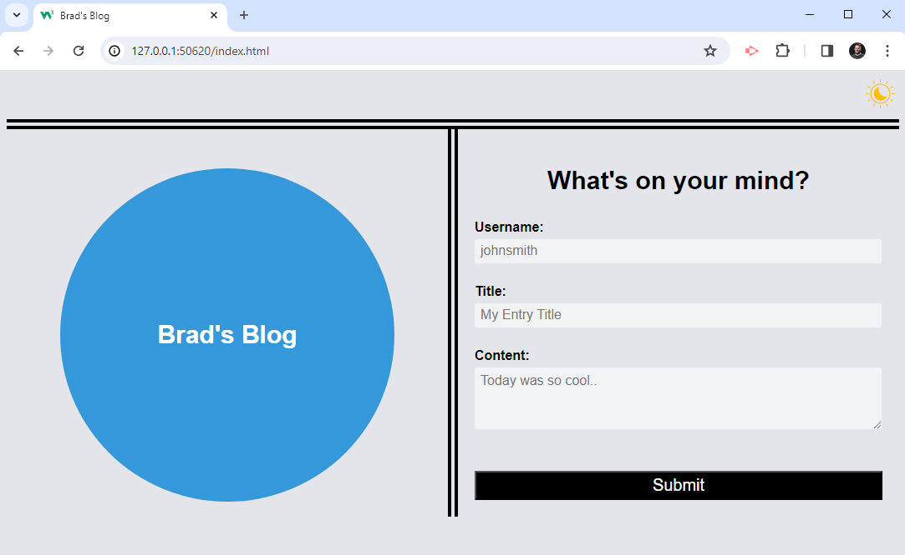

# Brad-Personal-Blog

Brad's Personal Blog
 
## Description
 
This webpage tracks the personal blogs of the user.  Each blog will record the Username, Title and Content of what the user wants to record.  After each blog entry, the user is brought to a page that lists all of their blog posts.  There is also a Light or Dark mode that the user can choose to have for the background.
 
## Image of My Website
 

 
## Visit My Website
 
[My Website](https://bradburr-github.github.io/Brad-Personal-Blog.html)
 
 ## License

This project is currently not licensed.